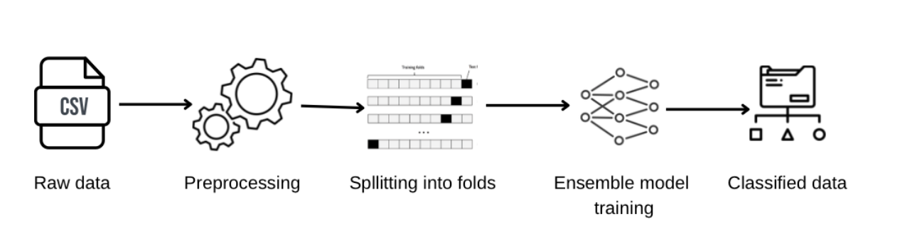
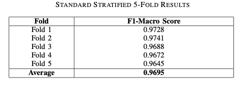
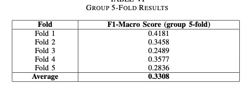

# Term Project - Emotion Recognition

## Task

The assignment is a multiclass emotion recognition task on tabular CSV data. The given training set consists of 22,496 samples from 19 persons, which introduces a strong subject-specific overfitting risk.

## Methods

The primary classification method is model ensembling using AutoGluon, a state-of-the-art AutoML framework. The pipeline follows raw CSV ingestion, preprocessing, split into folds, sequential ensemble training with F1-macro optimization, and final classified outputs.

Models were trained sequentially using the F1-Macro score. To address significant class imbalance, inverse class frequency was used to assign sample weights during training, so rare classes (especially Class 3) receive a higher penalty when misclassified.

## Main Pipeline

## Results

### Standard Stratified 5-Fold Results

### Group 5-Fold Results

## Files

- code.py: Main implementation.
- LFD_term_project_ieee.pdf: Full report.
- task/Term_Project_LFD_Fall2526.pdf: Assignment document.

to read more, look thru the report
