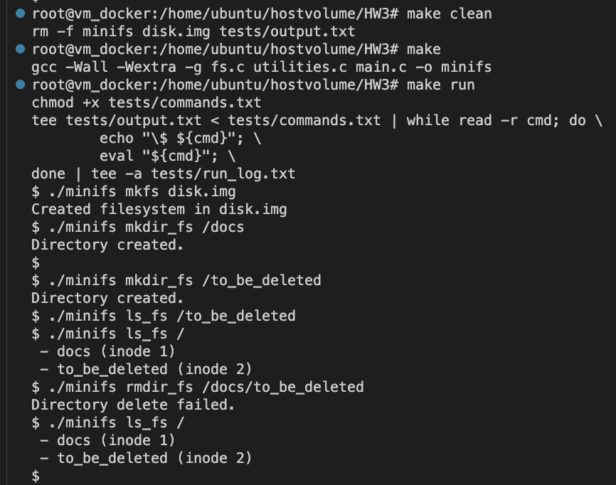
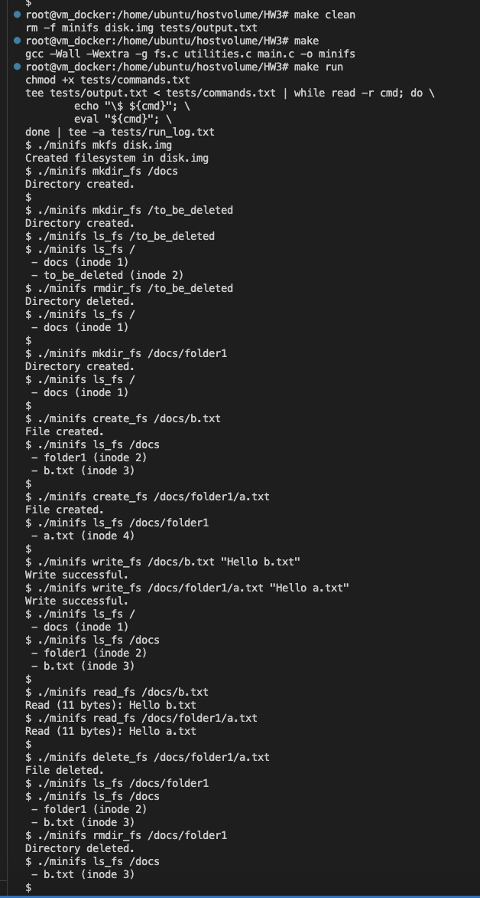

Computer Operating Systems - Homework Assignment 3: MiniFS
Done by Madina Alzhanova 150220939

This project implements simplified File System. It provides basic functionality to create, write, read and list files and directories inside a single disk.

Makefile runs commands from commands.txt and outputs can be seen both from terminal and run_log.txt.
To compile and run the program use makefile:
    make clean
    make
    make run

or compile manually, you can test your own commands:
    gcc -Wall -Wextra -g fs.c utilities.c main.c -o minifs
    ./minifs

Follow the format for command testing: <command> <path> [data]
    - command is one of the following:
        mkfs
        mkdir_fs
        create_fs
        write_fs
        read_fs
        delete_fs
        rmdir_fs
        ls_fs
    - path is absolute path starting from /
    - data is used for write_fs, example: "lalala"

    Demo screenshots:
Erroneous rmdir:

Terminal output:
